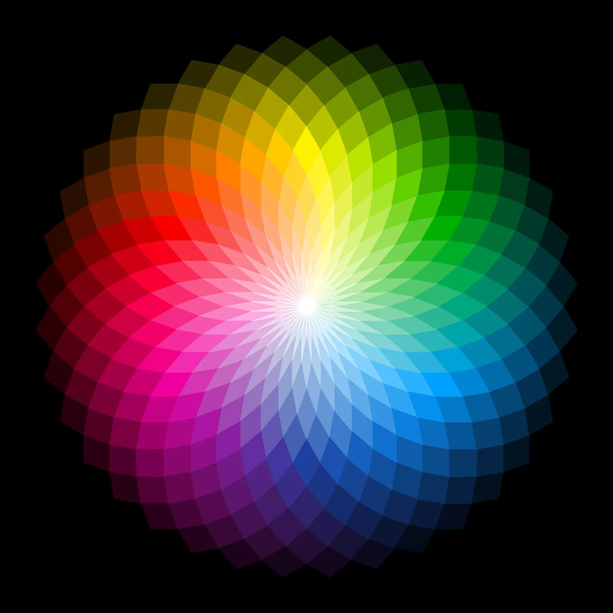

# 🎨 Guess a Color

A simple color guessing game built using **HTML, CSS, and JavaScript**.

## 📌 How to Play

1. Press any key to start the game.
2. Six colored boxes will appear.
3. Click on the box you think is the correct color.
4. The game will display **"Right Guess!"** or **"Wrong Guess!"** based on your choice.

## 🚀 Features

* Random color generation using JavaScript
* Interactive gameplay with DOM manipulation
* Dynamic background color updates
* Simple and responsive layout

## 🛠️ Built With

* HTML5
* CSS3
* JavaScript (Vanilla JS)

## 📂 Project Structure

```text
Guess-a-Color/
│── index.html
│── style.css
│── app.js
│── icon.jpg
└── README.md
```

## 🎯 What I Learned

This project helped me practice:

* DOM manipulation
* Event listeners
* Functions
* Loops and conditionals
* Random color generation (`Math.random()`)
* Working with multiple HTML elements using `querySelectorAll()`



---

Made with ❤️ while learning JavaScript.
